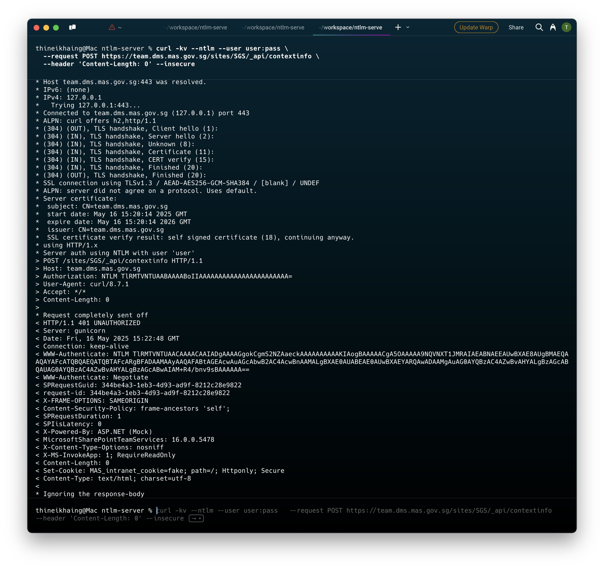
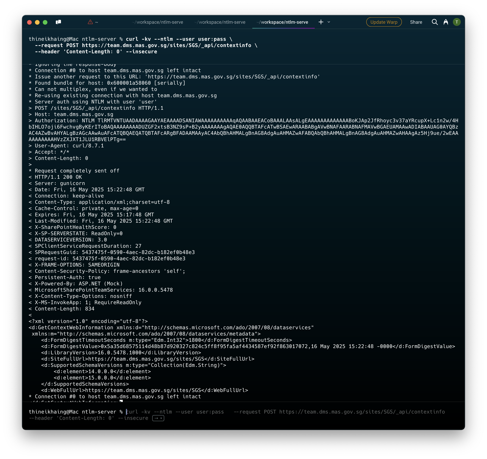

### Install Dependencies
```bash
pip3 install Flask
pip3 install gunicorn gevent
```

### Generate HTTPS certificate
In app/
```bash
openssl req -x509 -newkey rsa:2048 -nodes \
  -keyout key.pem -out cert.pem -days 365 \
  -subj "/CN=sharepointDNS"
```

### Add hostname to local resolution
In /etc/hosts:
```bash
127.0.0.1 sharepointDNS
```
### Run NTLM server with gunicorn
```bash
sudo gunicorn ntlm_mock_server:app \
  --certfile=cert.pem --keyfile=key.pem \
  --bind 0.0.0.0:443 --worker-class gevent --workers=1

sudo gunicorn ntlm_mock_server:app \
  --bind localhost:8181 --worker-class gevent --workers=1
```

### Test with curl
```bash
curl -kv --ntlm --user user:pass \
  --request POST https://sharepointDNS/sites/SGS/_api/contextinfo \
  --header 'Content-Length: 0' --insecure

curl -v --ntlm --user user:pass \
  --request POST http://localhost:8181/sites/SGS/_api/contextinfo \
  --header 'Content-Length: 0'
```




### Build and Run Docker Container 
```bash
docker build -t ntlm-mock-server .
docker run -d --name ntlm-mock \
  -p 443:443 \
  --add-host sharepointDNS:127.0.0.1 \
  ntlm-mock-server

podman run -d --name ntlm-mock-http \
  -p 8181:8181 \
  ntlm-mock-server
```